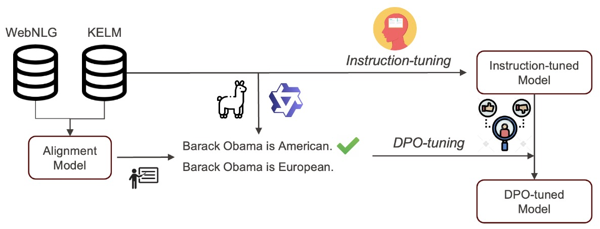

---

##### Download

+ [Paper (to be released)]()
+ [Code and data (to be released)]()

---

##### Abstract

We propose MuCAL (Multilingual Contrastive Alignment Learning) to tackle the challenge of Knowledge Graphs (KG)-to-Text generation using preference learning, where reliable preference data is scarce. MuCAL is a multilingual KG/Text alignment model achieving robust cross-modal retrieval across multiple languages and difficulty levels. Building on MuCAL, we automatically create preference data by ranking candidate texts from three LLMs (Qwen2.5, DeepSeek-v3, Llama-3). We then apply Direct Preference Optimization (DPO) on these preference data, bypassing typical reward modelling steps to directly align generation outputs with graph semantics. Extensive experiments on KG-to-English Text generation show two main advantages: (1) Our KG/text similarity models provide a better signal for DPO than similar existing metrics, and (2) significantly better generalisation on out-of-domain datasets compared to standard instruction tuning. Our results highlight MuCAL’s effectiveness in supporting preference learning for KG-to-English Text generation and lay the foundation for future multilingual extensions.

---

##### Flowchart



<!-- --- -->
<!-- 
##### Citation

Unterholzer, Detlev A., and  Moritz-Maria von Igelfeld. 2013. "Unusual Uses For Olive Oil." *Journal of Oleic Science* 34 (1): 449–489. http://www.alexandermccallsmith.com/book/unusual-uses-for-olive-oil.

```BibTeX
@article{UI13,
author = {Detlev A. Unterholzer and Moritz-Maria von Igelfeld},
year = {2013},
title ={Unusual Uses For Olive Oil},
journal = {Journal of Oleic Science},
volume = {34},
number = {1},
pages = {449--489},
url = {http://www.alexandermccallsmith.com/book/unusual-uses-for-olive-oil}}
```

--- -->

<!-- ##### Related material

+ [Presentation slides](presentation1.pdf)
+ [Summary of the paper](https://www.penguinrandomhouse.com/books/110403/unusual-uses-for-olive-oil-by-alexander-mccall-smith/) -->
