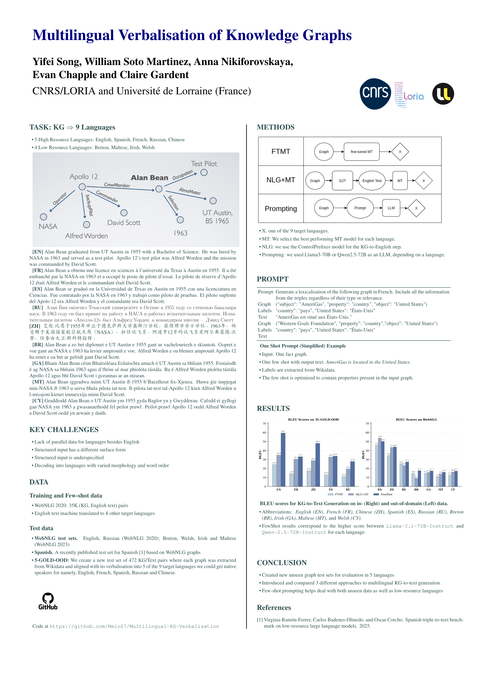

---

##### Download

+ [Paper Link](https://aclanthology.org/2025.findings-emnlp.60/)
+ [Code and data (Github)](https://github.com/MeloS7/Multilingual-KG-Verbalisation/tree/main)

---

##### Abstract

Most work on Knowledge Graph (KG) verbalisation is monolingual leaving open the question of how to scale KG-to-Text generation to languages with varying amounts of resources. In this work, we explore KG-to-Text generation on nine languages including five high-resource (HR) languages (English, Chinese, French, Spanish, Russian) and four low-resource (LR) languages (Breton, Irish, Maltese, Welsh). We first construct silver multilingual training data for all nine languages and new gold out-of-domain test data for the five HR languages. Using this data and already available in-domain test sets for 7 of our 9 languages, we then compare three strategies: (1) NLG+MT—a state-of-the-art KG-to-English model followed by Machine Translation (MT) into the target language; (2) FTMT—multilingual MT models fine-tuned end-to-end on the silver data; and (3) FewShot—few-shot LLM prompting comparing 4 LLMs. We explore different prompting strategies and show that our best prompting strategy performs the best on all 9 languages, discussing the relative performance of the three approaches on Low vs High Resource languages and on in- vs out-of-domain data.

---

##### Poster



#### Citation

```BibTex
@inproceedings{song-etal-2025-multilingual-verbalisation,
    title = "Multilingual Verbalisation of Knowledge Graphs",
    author = "Song, Yifei  and
      Martinez, William Soto  and
      Nikiforovskaya, Anna  and
      Chapple, Evan Parker Kelly  and
      Gardent, Claire",
    editor = "Christodoulopoulos, Christos  and
      Chakraborty, Tanmoy  and
      Rose, Carolyn  and
      Peng, Violet",
    booktitle = "Findings of the Association for Computational Linguistics: EMNLP 2025",
    month = nov,
    year = "2025",
    address = "Suzhou, China",
    publisher = "Association for Computational Linguistics",
    url = "https://aclanthology.org/2025.findings-emnlp.60/",
    doi = "10.18653/v1/2025.findings-emnlp.60",
    pages = "1111--1162",
    ISBN = "979-8-89176-335-7",
    abstract = "Most work on Knowledge Graph (KG) verbalisation is monolingual leaving open the question of how to scale KG-to-Text generation to languages with varying amounts of resources. In this work, we explore KG-to-Text generation on nine languages including five high-resource (HR) languages (English, Chinese, French, Spanish, Russian) and four low-resource (LR) languages (Breton, Irish, Maltese, Welsh). We first construct silver multilingual training data for all nine languages and new gold out-of-domain test data for the five HR languages. Using this data and already available in-domain test sets for 7 of our 9 languages, we then compare three strategies: (1) NLG+MT{---}a state-of-the-art KG-to-English model followed by Machine Translation (MT) into the target language; (2) FTMT{---}multilingual MT models fine-tuned end-to-end on the silver data; and (3) FewShot{---}few-shot LLM prompting comparing 4 LLMs. We explore different prompting strategies and show that our best prompting strategy performs the best on all 9 languages, discussing the relative performance of the three approaches on Low vs High Resource languages and on in- vs out-of-domain data.The models, the test set, and the silver training data are available at https://github.com/MeloS7/Multilingual-KG-Verbalisation."
}

```
<!-- ---

##### Citation

Prinzel, Florianus, and Moritz-Maria von Igelfeld. 2004. "The Finer Points of Sausage Dogs." *Journal of Canine Science* 43 (2): 89–109. http://www.alexandermccallsmith.com/book/the-finer-points-of-sausage-dogs.

```BibTeX
@article{PI04,
author = {Florianus Prinzel and Moritz-Maria von Igelfeld},
year = {2004},
title ={The Finer Points of Sausage Dogs},
journal = {Journal of Canine Science},
volume = {43},
number = {2},
pages = {89--109},
url = {http://www.alexandermccallsmith.com/book/the-finer-points-of-sausage-dogs}}
```

---

##### Related material

+ [Presentation slides](presentation2.pdf)
+ [Wikipedia entry](https://en.wikipedia.org/wiki/The_Finer_Points_of_Sausage_Dogs) -->
