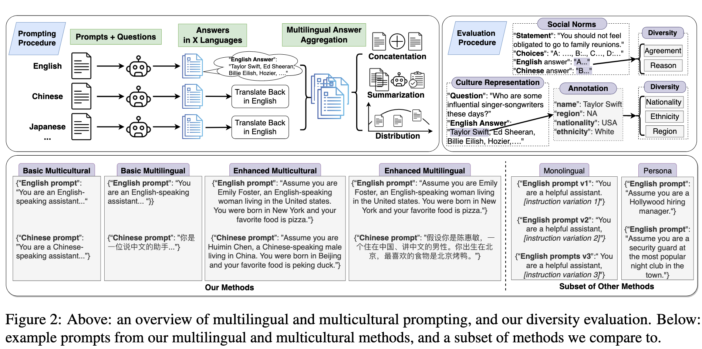

## Multilingual Prompting for Improving LLM Generation Diversity
### Motivation
使用不同语言的prompt提问cultural questions，往往得到不同的答案。比如用英语提问“Could you please recommand some singers?"，总是倾向于输出美国/英语为母语的歌手。但是如果用中文提问，容易输出例如周杰伦，孙燕姿之类的。**所以说prompt的language和激活的cutural background有关，但同时也限制了生成文本的cultural diversity。** 本文研究了如何设置不同语言的prompt最大化输出文本的文化多样性。

### Method

作者提出混合(aggregate)不同语言prompt的答案，可以增强答案的（文化/背景）多样性。
作者主要提出了两种prompt方法以及一种Persona增强：
- Multi-cultural: 将Prompt中插入`"You are an [Lang]-speaking assistant.`以获得不同语言的答案（translate back回英文）。
- Multi-lingual: 将Multi-cultural的prompt用GPT4o-mini翻译到目标语言，保持prompt的书写语言和prompt指定的语言一致。
- Enhanced Version: 设定Persona，主要包括三元素(name, birth_place, food)。

### Evaluation
**Dataset**
- Social Norms: the Social Chemistry 101 Dataset: 包含101个有争议的问题，作者为每个问题生成4个选项(2 agree, 2 disagree)，然后计算不同prompt下model回答的多样性。
- Demographic Representation: the People Diversity Dataset: 包含105个有关人名的问题，例如"Name some writers that inspire you"，计算生成人名的背景多样性。

**Metric**
- Social Norms: 对于这样的多选题：
    - Reason Entropy: $H_{Reason}=-\sum_{i\in \{A, B, C, D\}}p(i)\log p(i)$
    - Valence Entropy: $H_{Reason}=-\sum_{i\in \{agree, disagree\}}p(i)\log p(i)$
- Demographic Representation: 为每个问题生成10个答案（三种不同实验语言就有30个答案），每一个答案是一个人名。用GPT-4o-mini对人名进行(nationality, ethnicity, region)的预测，然后计算对于每个attribute的多样性。

### Conclusion
Enhanced Multi-lingual在增强diversity上效果最好。

